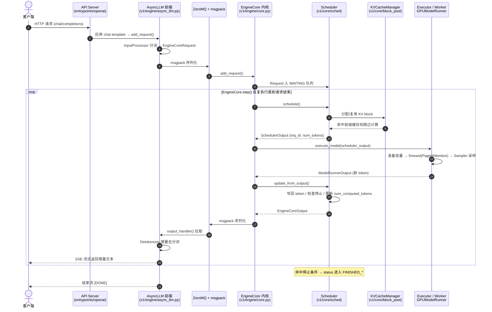

# vLLM 架构设计文档（基于 v0.15.1 / V1 架构）

> 本文档基于本仓库 `v0.15.1` 标签的源码与 vLLM 官方设计资料整理，聚焦 **V1 架构**（自 v0.8.0 起成为默认引擎，至今仍是主体骨架）。V0 已在 v0.10 起被移除，本文不再涉及。代码路径均以仓库根目录为基准。

---

## 1. 一句话定位

vLLM 是一个 **高吞吐、显存高效的 LLM 推理与服务引擎**。其核心竞争力来自三个发明/工程实现：

1. **PagedAttention** —— 把 KV cache 切成固定大小的「块（block）」分页管理，消除显存碎片；
2. **连续批处理（Continuous Batching）** —— 不区分 prefill/decode，按 token 粒度动态拼批，让 GPU 时刻满载；
3. **前缀缓存（Prefix Caching）** —— 相同前缀的 KV 自动复用，跨请求共享计算。

---

## 2. 分层总览

vLLM V1 自顶向下分为五层，每一层只依赖下一层提供的抽象接口：

```
┌─────────────────────────────────────────────────────────────┐
│  入口层 Entrypoints                                           │
│   - LLM 类（离线批量推理）        entrypoints/llm.py          │
│   - OpenAI 兼容 API Server（在线） entrypoints/openai/        │
│   - vllm CLI                      entrypoints/cli/            │
├─────────────────────────────────────────────────────────────┤
│  引擎前端 Engine Frontend                                     │
│   - AsyncLLM（异步，在线服务用）   v1/engine/async_llm.py     │
│   - LLMEngine（同步，离线用）      v1/engine/llm_engine.py    │
│   - 输入处理 / 分词 / 去分词       v1/engine/*processor.py     │
├──────────── ZeroMQ + msgpack 进程间通信（IPC） ──────────────┤
│  引擎内核 EngineCore（独立进程）   v1/engine/core.py          │
│   ┌────────────────┐   ┌──────────────────────────┐          │
│   │  Scheduler     │   │  KVCacheManager          │          │
│   │  调度器        │←→│  block_pool / prefix cache│          │
│   │  v1/core/sched │   │  v1/core/                │          │
│   └────────────────┘   └──────────────────────────┘          │
├─────────────────────────────────────────────────────────────┤
│  执行层 Executor                  v1/executor/               │
│   - UniProcExecutor（单卡）                                   │
│   - MultiprocExecutor（多进程 TP/PP）                         │
│   - RayDistributedExecutor（多机）                            │
├─────────────────────────────────────────────────────────────┤
│  Worker 层（每个加速器一个进程）  v1/worker/                 │
│   - GPUWorker                     v1/worker/gpu_worker.py     │
│   - GPUModelRunner（输入准备/forward/采样） gpu_model_runner.py│
│       └── Model（torch.nn.Module）+ Attention Backend         │
└─────────────────────────────────────────────────────────────┘
```

**关键的进程边界**：在线服务时，`AsyncLLM`（前端，跑在 API server 进程里）与 `EngineCore`（调度+执行内核，独立进程）通过 **ZeroMQ + msgpack** 通信。这样分词/去分词、HTTP 处理等 CPU 工作与 GPU 调度循环互不阻塞。离线 `LLM` 默认用 `InprocClient` 在同进程内直接调用 EngineCore。

---

## 3. 各层职责详解

### 3.1 入口层（Entrypoints）

| 入口 | 代码 | 用途 |
|------|------|------|
| `LLM` 类 | `entrypoints/llm.py:89` | 离线批量推理，`llm.generate(prompts, sampling_params)` |
| OpenAI API Server | `entrypoints/openai/api_server.py` | `vllm serve <model>`，提供 `/v1/chat/completions` 等端点 |
| CLI | `entrypoints/cli/` | `vllm serve` / `vllm bench` 等子命令 |

入口层负责：接收用户请求、应用 chat template、构造 `SamplingParams`/`PoolingParams`，然后把请求交给引擎前端。

### 3.2 引擎前端（Engine Frontend）

- **`AsyncLLM`**（`v1/engine/async_llm.py:80`）：在线服务的核心。基于 `asyncio`，为每个请求维护一个输出队列；后台 `output_handler()` 协程（`async_llm.py:645`）不断从 EngineCore 拉取输出、去分词、推送给对应请求的流。
- **`LLMEngine`**（`v1/engine/llm_engine.py`）：同步版本，离线推理用，内部是一个简单的 `step()` 循环。
- **输入/输出处理**：
  - `input_processor.py` —— 分词、多模态预处理，把原始 prompt 变成 `EngineCoreRequest`；
  - `output_processor.py` + `detokenizer.py` —— 把模型产生的 token id 增量去分词成文本，处理停止条件、logprobs。

### 3.3 引擎内核（EngineCore）—— 系统心脏

`EngineCore`（`v1/engine/core.py:78`）是「内循环」。它在独立进程里运行，初始化时做三件事：
1. 创建 `Executor`（加载模型）；
2. **显存剖析（profiling）** 后确定 KV cache 可用的 GPU/CPU block 数量（`_initialize_kv_caches`，`core.py:112`）；
3. 创建 `Scheduler` 和 `StructuredOutputManager`。

核心方法 `step()`（`core.py:369`）就是经典的推理循环：

```python
def step(self):
    if not self.scheduler.has_requests():
        return {}, False
    scheduler_output = self.scheduler.schedule()              # ① 调度
    future = self.model_executor.execute_model(..., non_block=True)  # ② 执行
    model_output = future.result()                            # ③ 取结果
    engine_core_outputs = self.scheduler.update_from_output(  # ④ 更新状态
        scheduler_output, model_output)
    return engine_core_outputs, ...
```

这正是 nano-vllm 主循环的「真实工业版」：调度 → 执行 → 采样 → 更新。

### 3.4 调度器（Scheduler）

代码：`v1/core/sched/scheduler.py:63`。

**V1 调度的核心思想**（见 `scheduler.py:314` 注释原文）：
> 调度器里没有「decode 阶段」也没有「prefill 阶段」。每个请求只有 `num_computed_tokens`（已算的 token 数）和 `num_tokens_with_spec`（prompt + 已生成 + 投机 token 总数）。每一步调度器尽量给每个请求分配 token，让 `num_computed_tokens` 追上 `num_tokens_with_spec`。

这个统一抽象天然覆盖了 **chunked prefill（分块预填充）、prefix caching、speculative decoding（投机解码）**。调度结果 `SchedulerOutput` 本质就是一个 `{request_id: num_scheduled_tokens}` 字典加上 KV block 分配信息。

调度顺序：先调度 `RUNNING` 队列（保证已在跑的请求继续），再从 `WAITING` 队列拉新请求，受 `token_budget`（`max_num_scheduled_tokens`）和可用 KV block 双重约束。显存不足时会 **抢占（preempt）** 低优先级请求（`RequestStatus.PREEMPTED`），释放其 block 给高优先级请求。

调度策略可选 FCFS 或 priority（`request_queue.py`）。还有 `async_scheduler.py` 提供异步调度（v0.15.1 中非默认，v0.19 起转为默认）。

### 3.5 KV Cache 管理（PagedAttention 的内存层）

| 组件 | 代码 | 职责 |
|------|------|------|
| `KVCacheManager` | `v1/core/kv_cache_manager.py:?` | Scheduler 与底层块管理之间的门面，对外提供 `KVCacheBlocks` |
| `BlockPool` | `v1/core/block_pool.py` | 物理块池：空闲块的分配/回收，前缀缓存哈希表 |
| `KVCacheCoordinator` | `v1/core/kv_cache_coordinator.py` | 协调多种 KV 类型（如 full-attention + Mamba 混合模型） |
| `SingleTypeKVCacheManager` | `v1/core/single_type_kv_cache_manager.py` | 单一类型 KV 的块管理 |

**核心数据结构**：`KVCacheBlocks`（`kv_cache_manager.py:21`）是 Scheduler ↔ KVCacheManager 的接口，隐藏底层块的实现细节。`blocks[i][j]` 表示第 i 个 kv_cache_group 的第 j 个块——支持「混合 KV cache」（如线性注意力 + 全注意力模型）。

**前缀缓存**：块按内容哈希（`BlockHash`），相同前缀的请求命中同一物理块，引用计数管理生命周期。详见 `core_concepts.md` 与 `docs/design/prefix_caching.md`。

### 3.6 执行层（Executor）

`Executor`（`v1/executor/abstract.py:35`）是抽象基类，根据 `distributed_executor_backend` 选择实现：

| Executor | 场景 |
|----------|------|
| `UniProcExecutor` | 单 GPU，同进程执行 |
| `MultiprocExecutor` | 单机多卡，张量并行（TP）/ 流水并行（PP），每卡一个子进程 |
| `RayDistributedExecutor` | 多机多卡，用 Ray 编排 |

统一接口：`execute_model(scheduler_output)` 和 `collective_rpc(method, args)`（向所有 worker 广播一次远程调用）。

### 3.7 Worker 与 ModelRunner

- **`GPUWorker`**（`v1/worker/gpu_worker.py`）：一个进程控制一张加速器。由 `rank`（全局编号，用于分布式编排）和 `local_rank`（本地编号，用于绑定设备）标识。负责初始化设备、分配 KV cache、调用 ModelRunner。
- **`GPUModelRunner`**（`v1/worker/gpu_model_runner.py`，v0.15.1 仍是经典的单体大文件）：worker 的执行主体，承担：
  1. **输入准备**：把 `SchedulerOutput` 转成 GPU 张量（input_ids、positions、block_table、attention metadata）；
  2. **forward**：调用 `model(...)`，可走 **CUDA Graph** 重放加速；
  3. **采样**：调用 Sampler 产生下一个 token。
- **Model**：实际的 `torch.nn.Module`，统一构造签名 `def __init__(self, *, vllm_config, prefix="")`，权重在初始化时即按 TP 分片/量化加载（避免先加载全量再切分的显存峰值）。

---

## 4. 一次请求的完整生命周期

以在线服务（AsyncLLM + 独立 EngineCore 进程）为例：

```
1. HTTP 请求 → OpenAI API Server
2. 应用 chat template → AsyncLLM.add_request()
3. InputProcessor 分词 → 构造 EngineCoreRequest
4. [msgpack 序列化 → ZeroMQ] → EngineCore 进程
5. EngineCore.add_request() → Request 入 WAITING 队列
   ┌──────────── EngineCore 主循环 step() 反复执行 ────────────┐
   6. Scheduler.schedule()                                      
      - 从 WAITING/RUNNING 选请求，分配 num_tokens 与 KV block  
      - 命中前缀缓存则复用已有 block                            
   7. Executor.execute_model() → Worker → GPUModelRunner        
      - 准备张量 → forward（PagedAttention）→ Sampler 采样      
   8. Scheduler.update_from_output()                            
      - 写回生成的 token，检查停止条件，更新 num_computed_tokens 
   └────────────────────────────────────────────────────────────┘
9. EngineCoreOutput [ZeroMQ → msgpack] → AsyncLLM.output_handler()
10. Detokenizer 增量去分词 → 推送到请求的输出流 → SSE 返回客户端
```

prefill 与 decode 在此循环中**没有阶段区分**：第一步给请求调度一大批 prompt token（可分块），后续每步调度 1 个（或 1+投机）新 token，全程同一套代码路径。

### 4.1 时序图（Mermaid）



> 离线 `LLM` 场景下，前端与内核同进程（`InprocClient`），上图中的 ZeroMQ/msgpack 环节被直接函数调用替代，其余流程一致。

---

## 5. 配置体系：VllmConfig 作为全局状态

vLLM 的所有类都接收一个 **`VllmConfig`** 对象（`vllm/config/`）。它聚合了 `ModelConfig`、`CacheConfig`、`ParallelConfig`、`SchedulerConfig`、`LoRAConfig` 等子配置。设计动机（见 `docs/design/arch_overview.md`）：

- **可扩展性**：新增特性只需往 `VllmConfig` 加字段，无需修改沿途所有构造函数；
- **统一性**：模型构造签名统一为 `(*, vllm_config, prefix)`，ModelRunner 无需为 50+ 种模型写不同的实例化逻辑；
- **初始化期分片/量化**：权重在加载时即按需切分，避免显存峰值。

可以把 `VllmConfig` 理解为「引擎级全局状态」，在整个类层级中传递。

---

## 6. 关键横切特性（与主线交织的能力）

| 特性 | 入口代码 | 说明 |
|------|----------|------|
| 张量/流水并行（TP/PP） | `distributed/`, `MultiprocExecutor` | 多卡切分模型 |
| 数据并行（DP） | `v1/worker/dp_utils.py`, `coordinator.py` | 多副本负载均衡 |
| 投机解码（Spec Decode） | `v1/spec_decode/`（EAGLE、ngram 等） | draft + verify，提升单请求吞吐 |
| 结构化输出 | `v1/structured_output/` | grammar/JSON 约束，生成 bitmask 屏蔽非法 token |
| 多模态 | `multimodal/`, `encoder_cache_manager.py` | 图像/音频编码 + 编码缓存 |
| LoRA | `lora/`, `lora_model_runner_mixin.py` | 多 adapter 动态切换 |
| Prefix Caching | `block_pool.py` | 跨请求 KV 复用（默认开启） |
| Chunked Prefill | Scheduler token_budget | 长 prompt 分块，避免阻塞 decode |
| CUDA Graph | `compilation/`, ModelRunner | 捕获并重放 forward，降低 kernel 启动开销 |
| torch.compile | `compilation/` | 图编译优化 |
| KV 卸载 / P/D 分离 | `v1/kv_offload/`, `distributed/kv_transfer/` | KV 跨设备/节点传输 |

---

## 7. 阅读源码的推荐顺序

为建立从 nano-vllm 到真实 vLLM 的心智桥梁，建议按此顺序读 v0.15.1 源码：

1. `v1/engine/core.py` —— EngineCore 的 `__init__` 与 `step()`，理解主循环；
2. `v1/engine/async_llm.py` —— 前端如何与内核解耦、流式输出；
3. `v1/core/sched/scheduler.py` —— `schedule()`，理解统一 token 调度；
4. `v1/core/kv_cache_manager.py` + `block_pool.py` —— 块分配与前缀缓存；
5. `v1/worker/gpu_model_runner.py` —— 输入准备 → forward → 采样（纯文本路径）；
6. `v1/executor/multiproc_executor.py` —— 多卡分布式执行。

遇到 `model_runner_v2` / MRV2 相关标记可先跳过（v0.15.1 主要用于多模态，纯文本默认仍走经典 `gpu_model_runner.py`）。

---

## 8. nano-vllm ↔ vLLM 对象映射

| nano-vllm | vLLM V1 |
|-----------|---------|
| `Sequence` / 请求对象 | `v1/request.py` 的 `Request` |
| `Scheduler` | `v1/core/sched/scheduler.py`（统一调度，不分 prefill/decode） |
| `BlockManager` | `v1/core/kv_cache_manager.py` / `block_pool.py` |
| `ModelRunner` | `v1/worker/gpu_model_runner.py` |
| `LLMEngine` 主循环 | `v1/engine/core.py`（EngineCore）+ `llm_engine.py` |

nano-vllm **没有**而真实 vLLM 新增的学习点：`AsyncLLM`/`EngineCore` 的多进程解耦（msgpack + ZeroMQ）、`MultiprocExecutor` 的分布式执行、CUDA Graph 捕获、前缀缓存的完整引用计数实现。

---

## 参考资料

- 官方架构概览：`docs/design/arch_overview.md`
- PagedAttention：`docs/design/paged_attention.md`
- 前缀缓存：`docs/design/prefix_caching.md`
- 混合 KV cache：`docs/design/hybrid_kv_cache_manager.md`
- 多进程：`docs/design/multiprocessing.md`
- CUDA Graph：`docs/design/cuda_graphs.md`
- torch.compile：`docs/design/torch_compile.md`
- 官方文档站：<https://docs.vllm.ai/en/latest/>
