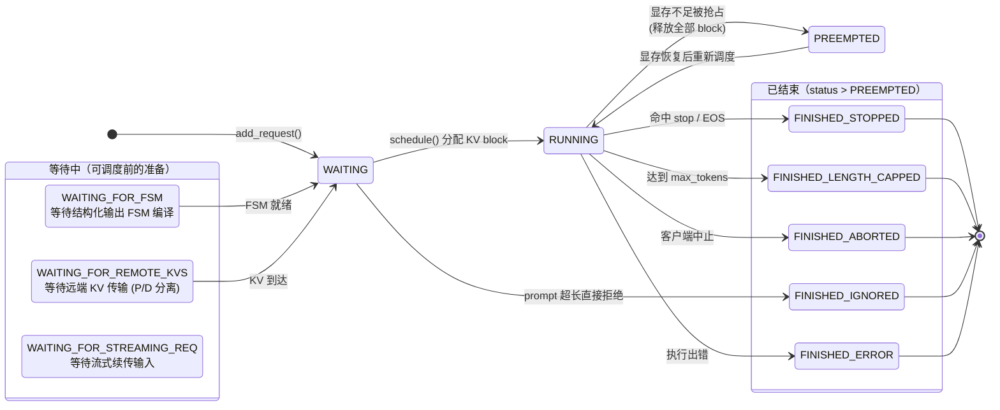

# vLLM 核心概念文档（基于 v0.15.1 / V1 架构）

> 本文档解释 vLLM V1 中最重要的若干核心概念。理解这些概念是读懂源码的前提。配套阅读 `architecture.md`。

---

## 概念地图

```
请求 Request ──→ 调度器 Scheduler ──→ KV Cache 管理 ──→ 模型执行
   │                  │  (统一 token 调度)    │ (PagedAttention)    │
   │                  │  连续批处理            │ Block / Prefix Cache│
SamplingParams     抢占/分块预填充          引用计数复用          采样 Sampling
```

---

## 1. Request（请求）—— 系统的基本工作单元

**代码**：`vllm/v1/request.py:59`

一个 `Request` 代表用户的一次推理请求，是调度与 KV 管理的最小单位。关键字段：

| 字段 | 含义 |
|------|------|
| `request_id` | 全局唯一标识 |
| `prompt_token_ids` | 输入 prompt 的 token id 列表 |
| `_output_token_ids` | 已生成的 token id |
| `num_computed_tokens` | **已经算过 KV 的 token 数**（调度的核心状态量） |
| `num_prompt_tokens` | prompt 长度 |
| `max_tokens` | 最多生成多少 token |
| `sampling_params` | 采样参数（生成模型） |
| `pooling_params` | 池化参数（embedding/分类模型，`max_tokens=1`） |
| `status` | 请求状态（见下） |

### 请求状态机（`RequestStatus`，`request.py:285`）

```
WAITING ──────────────┐
WAITING_FOR_FSM       │ (等待结构化输出 FSM 初始化)
WAITING_FOR_REMOTE_KVS│ (等待远端 KV 传输, P/D 分离)
        │             ↓
        └────────→ RUNNING ←──────┐
                     │            │ (显存恢复后重新调度)
                     ↓            │
                  PREEMPTED ──────┘  (显存不足被抢占, 释放 block)
                     │
                     ↓  (status > PREEMPTED 即为「已结束」)
   FINISHED_STOPPED / FINISHED_LENGTH_CAPPED /
   FINISHED_ABORTED / FINISHED_IGNORED / FINISHED_ERROR
```

> 设计要点：枚举值有序，`is_finished()` 只需判断 `status > PREEMPTED`（`request.py:307`）。

### 状态机图（Mermaid）



---

## 2. 统一 Token 调度（V1 的核心创新）

**代码**：`vllm/v1/core/sched/scheduler.py:313`（`schedule()` 方法）

### 旧世界 vs 新世界

- **V0（旧）**：调度器明确分「prefill 阶段」和「decode 阶段」，两套逻辑、两种批次，难以与分块预填充、投机解码等组合。
- **V1（新）**：**取消阶段区分**。每个请求只看两个数：
  - `num_computed_tokens`：已算的 token 数；
  - `num_tokens_with_spec` = `len(prompt) + len(output) + len(spec_tokens)`：目标 token 数。

每一步调度器做的事就是：给每个请求分配一些 token，让 `num_computed_tokens` 往 `num_tokens_with_spec` 追。

```
首步：  请求有 1000 个 prompt token，num_computed=0
        → 调度 512 个（分块预填充，受 token_budget 限制）→ num_computed=512
次步：  → 再调度 488 个 → num_computed=1000（prompt 算完）
此后：  每步生成 1 个新 token → 调度 1 个 → num_computed 每步 +1
```

**为什么这很优雅**：同一套代码天然支持
- **Chunked Prefill**（分块预填充）：长 prompt 分多步算，不阻塞其他请求 decode；
- **Prefix Caching**（前缀缓存）：命中的前缀直接算进 `num_computed_tokens`，跳过计算；
- **Speculative Decoding**（投机解码）：一步验证多个 draft token。

调度结果 `SchedulerOutput` 本质就是 `{request_id: num_scheduled_tokens}` + KV block 分配信息。

---

## 3. 连续批处理（Continuous Batching）

**位置**：`schedule()` 中先调度 `RUNNING` 队列、再从 `WAITING` 拉新请求的逻辑。

传统静态批处理：一批请求必须一起开始、一起结束，短请求要等长请求，GPU 利用率低。

连续批处理：**每一步重新组批**。某个请求生成完毕立即离开，空出的「槽位」马上由等待队列里的新请求填补，GPU 始终满载。这是 vLLM 高吞吐的关键之一。

约束条件：
- `token_budget`（`max_num_scheduled_tokens`）：一步最多处理的 token 总数；
- 可用 KV block 数：显存上限。

不足时触发 **抢占**。

---

## 4. 抢占（Preemption）

当显存（KV block）不足以让 RUNNING 请求继续时，调度器选择牺牲部分请求：

1. 把请求状态置为 `PREEMPTED`；
2. **释放它占用的所有 KV block** 归还 block pool；
3. 显存恢复后，被抢占请求重新进入调度（其已生成内容保留在 CPU/请求对象里，KV 需重算或从前缀缓存恢复）。

抢占顺序由调度策略决定（FCFS 优先保老请求，priority 模式按优先级）。

---

## 5. PagedAttention 与 KV Cache 分块

这是 vLLM 最著名的发明。详见 `docs/design/paged_attention.md`。

### 问题：KV cache 的显存碎片

自回归生成时，每个 token 的 Key/Value 向量要缓存下来供后续 attention 使用。请求长度不可预知，若按最大长度预分配连续显存，会造成巨大浪费（内部碎片）；按需扩张又会产生外部碎片。

### 解决：像操作系统分页一样管理 KV

- 把 KV cache 切成固定大小的 **块（block）**，每块存 `block_size` 个 token 的 KV（`block_size` 是 `CacheConfig` 配置项，见 `config/cache.py`）；
- 每个请求维护一张 **block table**（逻辑块号 → 物理块号映射），逻辑上连续、物理上分散；
- attention kernel 按 block table 间接寻址读取 KV。

**收益**：显存浪费从「按最大长度」降到「最多一个块的尾部」，吞吐大幅提升；块可灵活地分配、释放、共享。

### 相关组件

| 组件 | 代码 | 职责 |
|------|------|------|
| `KVCacheManager` | `v1/core/kv_cache_manager.py:94` | Scheduler 的门面，分配/释放块 |
| `KVCacheBlocks` | `v1/core/kv_cache_manager.py:21` | 块分配结果，对 Scheduler 隐藏内部结构 |
| `BlockPool` | `v1/core/block_pool.py` | 物理块池：空闲队列 + 前缀哈希表 |
| `KVCacheCoordinator` | `v1/core/kv_cache_coordinator.py` | 协调多种 KV 类型（混合模型） |

---

## 6. 前缀缓存（Prefix Caching）

**代码**：`v1/core/block_pool.py`，详见 `docs/design/prefix_caching.md`。

### 思想

多个请求常有相同前缀（同一 system prompt、同一 few-shot 示例、多轮对话历史）。这些前缀的 KV 计算结果完全相同，可以**跨请求复用**。

### 机制

1. 每个写满的 block 按其内容（token id 序列 + 前序块哈希）计算 **`BlockHash`**；
2. block pool 维护「哈希 → 物理块」表；
3. 新请求调度时，逐块查表，命中则直接复用已有物理块（计入 `num_computed_tokens`，**跳过这部分前向计算**），并增加块的引用计数；
4. 块的释放走引用计数：计数归零才真正回收到空闲队列；空闲块按 LRU 保留，以便后续命中。

**收益**：相同前缀的请求显著降低首 token 延迟（TTFP）与重复计算。v0.15.1 中前缀缓存默认开启。

---

## 7. 混合 KV Cache 与 KV Cache Group

**代码**：`v1/core/kv_cache_coordinator.py`、`single_type_kv_cache_manager.py`，详见 `docs/design/hybrid_kv_cache_manager.md`。

部分新模型在不同层用不同的注意力机制（如线性注意力 / Mamba 状态 + 标准全注意力）。它们的「KV」结构不同，需分组管理：

- **KV Cache Group**：同一类型 KV 的层归为一组；
- `KVCacheBlocks.blocks[i][j]`：第 i 组的第 j 个块；
- `KVCacheCoordinator` 统一协调各组的块分配。

纯 decoder-only 文本模型只有一个 group，可暂时忽略此复杂度。

---

## 8. SamplingParams（采样参数）与采样

**代码**：`vllm/sampling_params.py:117`，采样器 `v1/sample/`。

`SamplingParams` 控制生成行为，常用字段：

| 参数 | 含义 |
|------|------|
| `temperature` | 温度，0 表示贪心 |
| `top_p` / `top_k` | 核采样 / top-k 采样 |
| `max_tokens` | 最大生成长度 |
| `stop` / `stop_token_ids` | 停止字符串 / 停止 token |
| `n` | 一个 prompt 生成几个候选（并行采样，见 `parallel_sampling.py`） |
| `presence_penalty` / `frequency_penalty` | 重复惩罚 |
| `logprobs` | 返回 top-k token 概率 |
| `guided_decoding` | 结构化输出约束（JSON/grammar/regex） |

采样在 `GPUModelRunner` forward 之后执行，由 `v1/sample/` 下的算子完成；logits 处理器（`v1/sample/logits_processor/`）可在采样前修改 logits（惩罚、约束 bitmask 等）。

---

## 9. EngineCore 与多进程通信

**代码**：`v1/engine/core.py`、`v1/engine/core_client.py`、`v1/engine/async_llm.py`。

### 进程解耦

在线服务时为避免 CPU 工作（分词、HTTP、去分词）阻塞 GPU 调度循环，vLLM 把系统拆成两个进程：

- **前端进程**：`AsyncLLM`（跑在 API server 里），负责输入处理、去分词、流式输出；
- **内核进程**：`EngineCore`，负责调度 + 模型执行的紧密循环。

两者通过 **ZeroMQ（socket IPC）+ msgpack（序列化）** 通信（`core_client.py`）：
- `SyncMPClient`：用于离线 `LLM`（同步）；
- `AsyncMPClient`：用于在线 `AsyncLLM`（asyncio）；
- `InprocClient`（`core_client.py:258`）：单进程内直接调用，离线默认。

请求 `EngineCoreRequest` 被 msgpack 编码后经 ZeroMQ 送入内核；输出 `EngineCoreOutput` 同样编码回传，由前端的 `output_handler()` 协程分发。

---

## 10. Executor / Worker / ModelRunner 三件套

| 概念 | 代码 | 一句话 |
|------|------|--------|
| **Executor** | `v1/executor/abstract.py:35` | 决定模型「在哪些进程/机器上跑」（单卡/多卡/多机） |
| **Worker** | `v1/worker/gpu_worker.py` | 一个进程独占一张加速器，由 `rank`/`local_rank` 标识 |
| **ModelRunner** | `v1/worker/gpu_model_runner.py` | worker 内的执行主体：输入准备 → forward → 采样 |
| **Model** | `model_executor/models/` | 真正的 `torch.nn.Module`，统一构造签名 |

数据流：`EngineCore.step()` → `Executor.execute_model(scheduler_output)` → 广播给各 `Worker` → `GPUModelRunner` 准备张量、跑 forward（可走 CUDA Graph）、采样 → 结果回传。

并行维度：
- **TP（张量并行）**：单层权重切到多卡，每步需 all-reduce；
- **PP（流水并行）**：不同层放不同卡，按 micro-batch 流水；
- **DP（数据并行）**：整模型多副本，请求级负载均衡。

---

## 11. CUDA Graph 与 torch.compile（性能优化）

详见 `docs/design/cuda_graphs.md`、`docs/design/torch_compile.md`。

- **CUDA Graph**：decode 阶段 batch 形状相对固定，可把整个 forward 的 kernel 序列「录制」成一张图，后续直接重放，省去逐 kernel 的 CPU 启动开销。ModelRunner 在 warmup 阶段对若干常见 batch size 捕获图。
- **torch.compile**：对模型做图编译优化（算子融合等），由 `vllm/compilation/` 驱动，受 `CompilationMode` 控制。

---

## 12. 投机解码（Speculative Decoding）

**代码**：`v1/spec_decode/`（EAGLE、ngram、draft model 等）。

思想：用一个便宜的方法（小 draft 模型 / EAGLE 头 / n-gram 匹配）一次预测多个候选 token，再让大模型**一步并行验证**。验证通过的 token 被接受，否则回退。

与统一调度的契合点：`num_tokens_with_spec` 包含 spec token，调度器一步给请求分配多个 token 验证——无需特殊调度路径。接受率体现为吞吐提升。

---

## 13. 结构化输出（Structured Output）

**代码**：`v1/structured_output/`，`StructuredOutputManager`。

约束模型输出符合 JSON Schema / 正则 / grammar。机制：维护一个 FSM（有限状态机），每步根据当前状态生成 **bitmask**（`get_grammar_bitmask`，见 `core.py:382`），在采样前屏蔽所有不合法的 token。请求初始化时状态为 `WAITING_FOR_FSM`，FSM 编译完成后才进入正常调度。

**可插拔后端**（`v1/structured_output/backend_*.py`）：`xgrammar`（默认，最快）、`guidance`、`outlines`、`lm_format_enforcer`。后端把 schema 编译成 FSM/语法，提供「当前状态允许哪些 token」的查询。

---

## 14. 推理内容解析器（Reasoning Parser）

**代码**：`vllm/reasoning/`，抽象基类 `reasoning/abs_reasoning_parsers.py:36` 的 `ReasoningParser`。

### 背景

DeepSeek-R1、Qwen3、GLM4、Kimi-K2 等「推理模型」会先输出一段 **思维链（reasoning / thinking）**，再给出正式答案。典型格式用特殊标记包裹，如 `<think>……</think>` 后接最终回答。Reasoning parser 的职责是把模型原始输出**切分成「推理内容」和「正式内容」两部分**，分别填入 OpenAI 响应的 `reasoning_content` 与 `content` 字段。

### 接口（`ReasoningParser` 抽象方法）

| 方法 | 作用 |
|------|------|
| `extract_reasoning(model_output)` | 非流式：一次性切出 (reasoning, content) |
| `extract_reasoning_streaming(...)` | 流式：逐 delta 增量切分，判断当前 token 属于推理段还是正文段 |
| `is_reasoning_end(input_ids)` | 判断推理段是否已结束（供结构化输出引擎使用） |
| `extract_content_ids(input_ids)` | 取出正文部分的 token id |

### 与结构化输出的联动

`is_reasoning_end()` 很关键：当同时启用「推理 + 结构化输出」时，结构化约束（如 JSON）**只应作用于推理结束之后的正文**。推理阶段模型自由发挥，FSM bitmask 等推理结束信号出现后才开始生效。

### 注册机制

`ReasoningParserManager`（`abs_reasoning_parsers.py:161`）按名称注册/惰性加载具体解析器，CLI 用 `--reasoning-parser <name>`（如 `deepseek_r1`、`qwen3`）选择。每种模型一个实现文件（如 `deepseek_r1_reasoning_parser.py`）。

---

## 15. 工具调用解析器（Tool / Function Call Parser）

**代码**：`vllm/tool_parsers/`，抽象基类 `tool_parsers/abstract_tool_parser.py:34` 的 `ToolParser`。

### 背景

OpenAI 兼容 API 的 function calling / tool use：模型按训练时的特定格式输出工具调用（如 `<tool_call>{"name":...,"arguments":...}</tool_call>` 或 Hermes/Mistral/Llama 各自的格式）。Tool parser 负责把这些模型专有格式**解析成标准的 `tool_calls` 结构**返回给客户端。

### 接口

| 方法 | 作用 |
|------|------|
| `extract_tool_calls(model_output, request)` | 非流式：从完整输出解析出工具调用列表 |
| `extract_tool_calls_streaming(...)` | 流式：增量解析，边生成边吐出 tool_call delta |

### 注册与选择

`ToolParserManager`（`abstract_tool_parser.py:122`）注册具体实现；CLI 用 `--tool-call-parser <name>` + `--enable-auto-tool-choice` 启用。每种模型家族一个实现（`hermes`、`mistral`、`llama`、`deepseek_v3`、`glm4_moe` 等）。

> **Reasoning Parser 与 Tool Parser 的位置**：二者都属于**入口层（OpenAI server）的输出后处理**，发生在引擎之外、Detokenizer 之后。它们不影响 GPU 推理本身，只负责把模型生成的纯文本「结构化」成 OpenAI 协议字段。

---

## 16. 任务类型：生成模型 vs 池化模型（Task Types）

**代码**：`vllm/tasks.py`。

vLLM 不只做文本生成，还支持把同一套引擎用于 embedding、分类、打分。`SupportedTask` 分两大类：

| 类别 | 任务 | 说明 |
|------|------|------|
| **GenerationTask** | `generate`、`transcription` | 自回归生成，用 `SamplingParams` |
| **PoolingTask** | `embed`、`classify`、`score`、`token_embed`、`token_classify`、`plugin` | 只前向一次，对 hidden states 做池化，用 `PoolingParams` |

池化模型路径（`v1/pool/`）的请求 `max_tokens=1`（见 `request.py:100`），不进入自回归循环——前向一次拿到隐藏状态后由池化器（mean/last/cls 等）产出向量或分数。对应的 API 端点有 `/v1/embeddings`、`/score`、`/rerank` 等。

---

## 17. 多模态与编码缓存（Multimodal & Encoder Cache）

**代码**：`vllm/multimodal/`、`v1/core/encoder_cache_manager.py`。

多模态模型（VLM，如图像/音频输入）的请求带 `mm_features`（`request.py:70`）。处理链路：

1. **预处理**：`multimodal/` 把图像/音频转成模型输入（`MultiModalFeatureSpec`）；
2. **编码（encoder）**：视觉/音频编码器把媒体编码成 embedding，开销大；
3. **编码缓存**：`EncoderCacheManager` 缓存编码结果，相同媒体复用，避免重复编码（类比文本的前缀缓存）；
4. **融合**：编码 embedding 与文本 token embedding 拼接，送入语言模型主体。

调度器有独立的 `encoder_compute_budget`（`scheduler.py:335`）限制每步编码的 token 量，避免编码阻塞主流程。

> 注：v0.15.1 中 Model Runner V2（MRV2）主要就是先在多模态路径落地的；纯文本路径默认仍走经典 `gpu_model_runner.py`。

---

## 18. KV Connector 与 P/D 分离（Prefill/Decode Disaggregation）

**代码**：`vllm/distributed/kv_transfer/kv_connector/v1/`、`v1/kv_offload/`。

大规模部署常把 **prefill（算 prompt KV，计算密集）** 与 **decode（逐 token 生成，访存密集）** 拆到不同实例上，各自优化硬件配比。这要求把 prefill 产生的 KV cache **跨进程/跨节点传输**给 decode 实例。

- **KV Connector**：抽象的 KV 传输接口（`KVConnectorBase_V1`），具体实现有 `lmcache`、`mooncake`、`nixl` 等；
- 请求字段 `kv_transfer_params`（`request.py:96`）携带连接器所需的传输参数；
- 状态 `WAITING_FOR_REMOTE_KVS` 表示 decode 实例正等待远端 KV 到达后才能开始；
- `v1/kv_offload/` 则负责把 KV 卸载到 CPU/磁盘等更便宜的存储层，扩大有效缓存容量。

---

## 19. LoRA（多适配器动态切换）

**代码**：`vllm/lora/`，`LoRARequest`（`lora/request.py:8`），`v1/worker/lora_model_runner_mixin.py`。

LoRA 让一个基座模型同时服务多个微调适配器：请求通过 `lora_request` 指定用哪个 adapter，ModelRunner 在一个 batch 内为不同请求应用不同的 LoRA 权重（分组矩阵乘）。因每个 adapter 的 EOS token 可能不同，`Request.eos_token_id` 是按请求存储的（`request.py:83`）。

---

## 概念之间的关系总结

1. 用户请求变成 **Request**，带着 **SamplingParams** 进入 **WAITING** 队列；
2. **Scheduler** 用**统一 token 调度**做**连续批处理**，受 token budget 和 KV block 约束，必要时**抢占**；
3. **KVCacheManager** 用 **PagedAttention 的分块**机制分配 KV，**前缀缓存**让相同前缀复用；
4. **Executor → Worker → ModelRunner** 执行 forward（**PagedAttention** kernel + 可选 **CUDA Graph**），**Sampler** 按 SamplingParams 采样（可叠加**结构化输出** bitmask、**投机解码**验证）；
5. 结果经 **EngineCore → ZeroMQ → AsyncLLM** 去分词后流式返回；在 OpenAI server 出口，**Reasoning Parser** 切出思维链、**Tool Parser** 解析工具调用，组装成协议字段；
6. 请求 `num_computed_tokens` 持续推进，直到命中停止条件进入 **FINISHED**。

> 上述是**生成模型**主线；**池化模型**（embed/classify/score）只前向一次即出结果，不走自回归循环。多模态请求在进入语言模型前先经**编码器 + 编码缓存**；大规模部署可用 **KV Connector** 做 P/D 分离与 KV 卸载。

### 概念分层归位

| 所在层 | 相关概念 |
|--------|----------|
| 入口层（OpenAI server 输出后处理） | Reasoning Parser、Tool Parser |
| 引擎前端 | 多进程通信、去分词、流式输出 |
| 调度器 | 统一 token 调度、连续批处理、抢占、分块预填充、编码预算 |
| KV 管理 | PagedAttention 分块、前缀缓存、混合 KV、编码缓存、KV Connector / 卸载 |
| 执行层 | Executor/Worker/ModelRunner、TP/PP/DP、CUDA Graph、torch.compile |
| 采样出口 | Sampler、结构化输出 bitmask、投机解码验证 |
| 横切 | Request 状态机、SamplingParams/PoolingParams、任务类型、LoRA |

---

## 参考资料

- PagedAttention：`docs/design/paged_attention.md`
- 前缀缓存：`docs/design/prefix_caching.md`
- 混合 KV cache：`docs/design/hybrid_kv_cache_manager.md`
- CUDA Graph：`docs/design/cuda_graphs.md`
- torch.compile：`docs/design/torch_compile.md`
- 架构概览：`docs/design/arch_overview.md`
- P/D 分离连接器：`docs/design/p2p_nccl_connector.md`
- 推理解析器（功能文档）：<https://docs.vllm.ai/en/latest/features/reasoning_outputs/>
- 工具调用（功能文档）：<https://docs.vllm.ai/en/latest/features/tool_calling/>
- 配套文档：`architecture.md`
